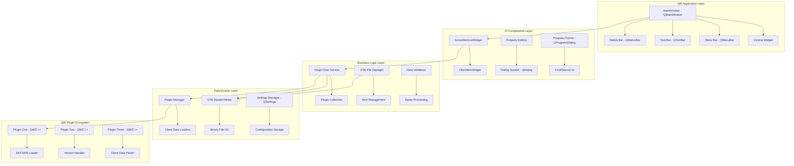

# Design Document

## Overview

This design document outlines the migration strategy for the legacy ItemEditor application from Windows Forms/.NET Framework 4.6.1 to a modern Qt6-based C++ application. The migration will use **Qt6** as the target framework, providing 100% functional parity while modernizing the codebase for improved maintainability and performance on Windows x86 architecture.

The legacy ItemEditor is a specialized tool for editing OTB (Open Tibia Binary) data files with a plugin-based architecture, dark UI theme, and comprehensive item editing capabilities. The application supports game versions 8.00-10.77 and features sprite visualization, attribute management, and data validation through a sophisticated plugin system.

### Key Design Principles

1. **100% Functional Parity**: Every feature, behavior, and user interaction must be preserved exactly
2. **Plugin Architecture Preservation**: Rewrite all plugins in native Qt6/C++ with equivalent functionality
3. **Visual Fidelity**: Replicate the dark UI theme and pixel-perfect layouts using Qt StyleSheets
4. **Windows x86 Optimization**: Target Windows x86 architecture specifically for optimal performance
5. **Performance Equivalency**: Match or exceed legacy system performance characteristics
6. **Data Integrity**: Ensure byte-identical file operations and data processing

## Architecture

### Target Framework Selection: Qt6

**Qt6** has been selected as the optimal choice for this migration based on the specific requirements:

**Advantages:**
- Mature, stable framework with excellent Windows support
- Native performance with C++ implementation
- Comprehensive widget system for complex UI requirements
- Excellent support for custom controls and dark themes
- Robust plugin architecture through Qt's plugin system
- Strong binary file I/O capabilities
- Proven track record for desktop applications
- x86 architecture optimization

**Architecture Stack:**
- **UI Framework**: Qt6 (6.5+ LTS)
- **Language**: C++17/20
- **Target Platform**: Windows x86
- **Plugin System**: Native Qt6 plugin framework with all plugins rewritten in C++
- **Data Layer**: Native C++ implementation of OTB/DAT/SPR file handling
- **Theming**: Qt StyleSheets and custom dark theme
- **Build System**: CMake with Qt6 integration

### High-Level Architecture Diagram



## Components and Interfaces

### Core Application Components

#### 1. MainWindow (Qt6)
**Purpose**: Primary application window replacing Windows Forms MainForm
**Key Features**:
- QMainWindow with custom dark theme using Qt StyleSheets
- QMenuBar with identical structure to legacy system
- QToolBar with same button layout and functionality
- QStatusBar showing item counts and loading progress
- QDockWidget panels for item list and property editors

**Implementation Strategy**:
```cpp
class MainWindow : public QMainWindow
{
    Q_OBJECT

public:
    explicit MainWindow(QWidget *parent = nullptr);
    ~MainWindow();

private slots:
    void openFile();
    void saveFile();
    void onItemSelected(const ServerItem& item);

private:
    void setupUI();
    void applyDarkTheme();
    void initializePluginSystem();
    
    Ui::MainWindow *ui;
    PluginManager *pluginManager;
    OtbFileManager *fileManager;
    ServerItemListWidget *itemListWidget;
    PropertyEditorWidget *propertyEditor;
};
```

#### 2. Plugin System Architecture
**Purpose**: Native Qt6 plugin system with all plugins rewritten in C++
**Key Components**:
- Qt6 plugin interface using QObject and Q_PLUGIN_METADATA
- Plugin discovery and loading mechanism using QPluginLoader
- Plugin lifecycle management with Qt's plugin system
- Native C++ plugin implementations

**Plugin Interface**:
```cpp
class IPlugin : public QObject
{
    Q_OBJECT
    
public:
    virtual ~IPlugin() = default;
    
    virtual bool initialize() = 0;
    virtual QString name() const = 0;
    virtual QString version() const = 0;
    virtual QStringList supportedVersions() const = 0;
    virtual bool loadClient(const QString& datPath, const QString& sprPath) = 0;
    virtual QByteArray getClientData(quint16 clientId) = 0;
    virtual void cleanup() = 0;
};

Q_DECLARE_INTERFACE(IPlugin, "com.itemeditor.IPlugin/1.0")
```

#### 3. Data Management Layer
**Purpose**: Handle OTB file operations with byte-identical output
**Key Components**:
- `OtbReader` class for parsing binary OTB files
- `OtbWriter` class for generating binary OTB files
- `ServerItemList` collection management
- `ClientItem` and `ServerItem` data models

**C++ Implementation**:
```cpp
class OtbReader
{
public:
    bool readFile(const QString& filePath);
    ServerItemList getItems() const;
    quint32 getVersion() const;
    
private:
    QByteArray fileData;
    ServerItemList items;
    quint32 version;
};

class ServerItem
{
public:
    quint16 id;
    ServerItemType type;
    TileStackOrder stackOrder;
    QString name;
    QByteArray spriteHash;
    // ... all properties from legacy system
};
```

#### 4. UI Control Library
**Purpose**: Replicate specialized controls from legacy system
**Key Controls**:
- `ServerItemListWidget` - Custom QListWidget for item display
- `ClientItemWidget` - Custom QWidget for sprite visualization
- `FlagCheckBox` - Custom QCheckBox for item flags
- Property editor controls with validation

### Plugin Interface Implementation

#### Native Qt6 Plugin System
All plugins will be completely rewritten in Qt6/C++ using Qt's native plugin system:

```cpp
// Example plugin implementation
class PluginOne : public QObject, public IPlugin
{
    Q_OBJECT
    Q_PLUGIN_METADATA(IID "com.itemeditor.IPlugin/1.0" FILE "pluginone.json")
    Q_INTERFACES(IPlugin)

public:
    bool initialize() override;
    QString name() const override { return "Plugin One"; }
    QString version() const override { return "1.0.0"; }
    QStringList supportedVersions() const override;
    bool loadClient(const QString& datPath, const QString& sprPath) override;
    QByteArray getClientData(quint16 clientId) override;
    void cleanup() override;

private:
    // Native C++ implementation for DAT/SPR parsing
    bool parseDatFile(const QString& filePath);
    bool parseSprFile(const QString& filePath);
};
```

#### Client Data Integration
Each rewritten plugin handles specific game client versions:
- Plugin One (Qt6/C++): Handles client versions 8.00-8.57
- Plugin Two (Qt6/C++): Handles client versions 8.60-9.86
- Plugin Three (Qt6/C++): Handles client versions 10.00-10.77

### Windows x86 Optimizations

#### Architecture-Specific Implementations
```cpp
class PlatformServices
{
public:
    static void initializeWindows();
    static void configureFileAssociations();
    static void setupWindowsIntegration();
    static void optimizeForX86();
    
private:
    static void enableLargeAddressAware();
    static void configureMemoryManagement();
};
```

## Data Models

### Core Data Structures

#### Item Hierarchy
```cpp
class Item
{
public:
    quint16 id;
    ServerItemType type;
    TileStackOrder stackOrder;
    QString name;
    QByteArray spriteHash;
    // ... all existing properties preserved
    
    virtual ~Item() = default;
};

class ClientItem : public Item
{
public:
    quint8 width;
    quint8 height;
    QList<Sprite> spriteList;
    QVector<QVector<double>> spriteSignature;
    // ... additional client-specific properties
};

class ServerItem : public Item
{
public:
    quint16 clientId;
    quint16 previousClientId;
    bool isCustomCreated;
    // ... server-specific properties
};
```

#### File Format Structures
```cpp
class ServerItemList : public QList<ServerItem>
{
public:
    quint32 majorVersion;
    quint32 minorVersion;
    quint32 buildNumber;
    quint32 clientVersion;
    quint16 minId;
    quint16 maxId;
};
```

### Data Processing Pipeline

#### OTB File Operations
1. **Reading**: Binary file parsing with exact legacy compatibility
2. **Validation**: Item property validation using existing rules
3. **Modification**: In-memory item manipulation
4. **Writing**: Binary file generation with byte-identical output

#### Sprite Processing
1. **Loading**: DAT/SPR file parsing through plugins
2. **Hashing**: MD5 hash calculation for sprite comparison
3. **Signature**: Fourier transform-based similarity analysis
4. **Rendering**: Bitmap generation for UI display

## Error Handling

### Error Categories and Strategies

#### 1. File I/O Errors
**Strategy**: Preserve exact error messages and recovery behavior
```cpp
class FileOperationException : public std::exception
{
public:
    FileOperationException(const QString& message, const std::exception& innerException)
        : message_(message), innerException_(innerException)
    {
        // Log error with same format as legacy system
        // Provide identical user feedback
    }
    
    const char* what() const noexcept override {
        return message_.toStdString().c_str();
    }

private:
    QString message_;
    std::exception innerException_;
};
```

#### 2. Plugin Loading Errors
**Strategy**: Graceful degradation with user notification
```cpp
class PluginLoadException : public std::exception
{
public:
    QString pluginPath;
    QString pluginName;
    
    PluginLoadException(const QString& path, const QString& name)
        : pluginPath(path), pluginName(name) {}
    
    // Maintain same error reporting as legacy system
};
```

#### 3. Data Validation Errors
**Strategy**: Real-time validation with visual feedback
```cpp
enum class ValidationSeverity {
    Info,
    Warning,
    Error
};

struct ValidationError {
    QString message;
    ValidationSeverity severity;
};

class ValidationResult
{
public:
    bool isValid;
    QList<ValidationError> errors;
    ValidationSeverity severity;
};
```

#### 4. Memory and Resource Management
**Strategy**: Proactive resource cleanup and monitoring using Qt's parent-child system
```cpp
class ResourceManager : public QObject
{
    Q_OBJECT
    
public:
    explicit ResourceManager(QObject* parent = nullptr) : QObject(parent) {}
    
    void registerResource(QObject* resource) {
        resource->setParent(this);
    }
    
    ~ResourceManager() {
        // Qt automatically cleans up child objects
    }
};
```

## Testing Strategy

### Testing Approach Overview
The testing strategy ensures 100% functional parity through comprehensive validation at multiple levels.

#### 1. Unit Testing
**Scope**: Individual components and business logic
**Framework**: Qt Test Framework with QTestLib
**Coverage**: 
- Data model operations
- File I/O operations
- Plugin loading and management
- Validation logic

#### 2. Integration Testing
**Scope**: Component interactions and data flow
**Focus Areas**:
- Plugin system integration
- File format compatibility
- UI component interactions
- Windows platform behavior

#### 3. Compatibility Testing
**Scope**: Verification against legacy system behavior
**Methodology**:
- Byte-level file output comparison
- UI layout pixel comparison
- Performance benchmarking
- Plugin compatibility validation

#### 4. Platform Testing
**Scope**: Windows x86 platform validation
**Focus**:
- Windows 10/11 compatibility
- x86 architecture optimization
- Windows-specific integrations

### Test Data and Scenarios

#### Test OTB Files
- Sample files from each supported client version (8.00-10.77)
- Edge cases: corrupted files, empty files, maximum size files
- Custom created items and modifications

#### Plugin Testing
- Load each plugin independently
- Test plugin switching and version compatibility
- Validate client data loading and sprite processing

#### UI Testing Framework
```cpp
class MainWindowTest : public QObject
{
    Q_OBJECT

private slots:
    void testMainWindowLoadsCorrectly();
    void testMenuBarCreation();
    void testToolBarSetup();
    void testStatusBarDisplay();
};

void MainWindowTest::testMainWindowLoadsCorrectly()
{
    MainWindow window;
    window.show();
    
    QVERIFY(window.isVisible());
    QVERIFY(window.menuBar() != nullptr);
    QVERIFY(window.statusBar() != nullptr);
}
```

### Performance Testing

#### Benchmarking Criteria
1. **File Loading Performance**: OTB files should load within same time bounds
2. **Memory Usage**: Memory footprint should not exceed legacy system by >10%
3. **UI Responsiveness**: All UI operations should complete within legacy timeframes
4. **Plugin Loading**: Plugin initialization should match legacy performance

#### Performance Monitoring
```cpp
class PerformanceMonitor
{
public:
    static void measureOperation(const QString& operationName, std::function<void()> operation)
    {
        QElapsedTimer timer;
        timer.start();
        
        operation();
        
        qint64 elapsed = timer.elapsed();
        qDebug() << "Operation" << operationName << "took" << elapsed << "ms";
    }
};
```

## UI/UX Design Specifications

### Visual Design System

#### Color Palette (DarkUI Theme)
```cpp
class DarkTheme
{
public:
    static const QColor DarkBackground;
    static const QColor LightBackground;
    static const QColor LightText;
    static const QColor DisabledText;
    static const QColor BlueHighlight;
    static const QColor RedHighlight;
};

// Implementation
const QColor DarkTheme::DarkBackground = QColor(60, 63, 65);
const QColor DarkTheme::LightBackground = QColor(69, 73, 74);
const QColor DarkTheme::LightText = QColor(220, 220, 220);
const QColor DarkTheme::DisabledText = QColor(153, 153, 153);
const QColor DarkTheme::BlueHighlight = QColor(104, 151, 187);
const QColor DarkTheme::RedHighlight = QColor(204, 120, 50);
```

#### Typography
- **Primary Font**: Segoe UI, 9pt (Windows)
- **Monospace Font**: Consolas, 8pt for technical data display
- **Icon Font**: Embedded icon resources matching legacy system

#### Layout Specifications
- **Main Window**: Minimum 800x600, default 1024x768
- **Item List Panel**: 250px width, resizable
- **Property Panel**: 300px width, resizable
- **Toolbar Height**: 28px with 24x24 icons
- **Status Bar Height**: 22px

### Control Specifications

#### ServerItemListWidget
**Purpose**: Display filterable list of server items
**Features**:
- Virtual scrolling for performance
- Custom item rendering with icons
- Multi-column display (ID, Name, Type)
- Filtering and search capabilities
- Context menu integration

#### ClientItemWidget
**Purpose**: Display sprite visualization
**Features**:
- 32x32 pixel sprite rendering
- Transparency support
- Animation frame display
- Zoom capabilities
- Background color indication for validation status

#### Property Editors
**Purpose**: Edit item attributes with validation
**Features**:
- Real-time validation feedback
- Color-coded mismatch indicators
- Tooltip display for expected values
- Undo/redo support
- Batch editing capabilities

### Windows Platform Optimization

#### Window Scaling
- Support for high-DPI displays
- Automatic scaling based on system settings
- Minimum and maximum window constraints
- Layout adaptation for different screen sizes

#### Windows Platform Integration
- **Windows**: Native Windows 11 styling with Qt6 Windows style
- **High-DPI**: Automatic scaling for 4K displays
- **Integration**: Windows shell integration and file associations

## Deployment and Distribution

### Build Configuration

#### Project Structure
```
ItemEditor.Qt6/
├── src/
│   ├── ItemEditor.Core/           # Business logic and data models
│   ├── ItemEditor.UI/             # Qt6 UI application
│   ├── ItemEditor.Plugins/        # Plugin interfaces and base classes
│   └── ItemEditor.Tests/          # Test projects
├── plugins/
│   ├── PluginOne/                 # Client version 8.00-8.57
│   ├── PluginTwo/                 # Client version 8.60-9.86
│   └── PluginThree/               # Client version 10.00-10.77
└── assets/
    ├── icons/                     # Application icons
    ├── themes/                    # UI themes and styles
    └── resources/                 # Embedded resources
```

#### Build Configuration (CMakeLists.txt)
```cmake
cmake_minimum_required(VERSION 3.16)
project(ItemEditor VERSION 1.0.0 LANGUAGES CXX)

set(CMAKE_CXX_STANDARD 17)
set(CMAKE_CXX_STANDARD_REQUIRED ON)

find_package(Qt6 REQUIRED COMPONENTS Core Widgets)

qt6_standard_project_setup()

add_executable(ItemEditor
    src/main.cpp
    src/MainWindow.cpp
    src/MainWindow.h
    # ... other source files
)

target_link_libraries(ItemEditor Qt6::Core Qt6::Widgets)
```

### Platform-Specific Packaging

#### Windows
- **Format**: MSI installer and portable executable
- **Requirements**: Qt6 Runtime libraries, Visual C++ Redistributable
- **Features**: File associations, Start Menu integration, Auto-updater

### Distribution Strategy

#### Release Channels
1. **Stable**: Fully tested releases with complete feature parity
2. **Beta**: Feature-complete releases for testing
3. **Alpha**: Development builds for early feedback

#### Update Mechanism
- Automatic update checking (optional)
- Delta updates for efficiency
- Rollback capability for failed updates
- Plugin compatibility verification during updates

## Migration Implementation Plan

### Phase 1: Core Infrastructure (Weeks 1-4)
1. Set up Qt6 project structure with CMake
2. Implement basic QMainWindow application shell
3. Port core data models and interfaces to C++
4. Establish native Qt6 plugin loading framework

### Phase 2: Data Layer Migration (Weeks 5-8)
1. Port OTB file reading/writing logic to C++
2. Implement binary compatibility validation
3. Port sprite processing algorithms
4. Validate data integrity with test files

### Phase 3: UI Component Development (Weeks 9-16)
1. Implement Qt6 main window layout
2. Port specialized controls (ServerItemListWidget, ClientItemWidget)
3. Implement Qt dialog system
4. Apply dark theme using Qt StyleSheets

### Phase 4: Plugin System Integration (Weeks 17-20)
1. Rewrite all three plugins in native Qt6/C++ 
2. Implement plugin discovery and loading with Qt's plugin system
3. Validate client data integration with rewritten plugins
4. Test cross-version compatibility

### Phase 5: Feature Completion (Weeks 21-24)
1. Implement remaining features (find, compare, etc.)
2. Add Windows-specific optimizations
3. Implement QSettings configuration management
4. Complete error handling and validation

### Phase 6: Testing and Validation (Weeks 25-28)
1. Comprehensive functional testing with Qt Test
2. Windows platform compatibility testing
3. Performance benchmarking
4. User acceptance testing

### Phase 7: Deployment and Documentation (Weeks 29-32)
1. Package for Windows x86 platform
2. Create installation and deployment guides
3. Document migration process
4. Prepare release artifacts

## Risk Mitigation

### Technical Risks

#### 1. Plugin Rewrite Complexity
**Risk**: Rewriting all plugins in Qt6/C++ may introduce bugs or missing functionality
**Mitigation**: 
- Maintain exact functional parity through comprehensive testing
- Create detailed plugin migration specifications
- Implement thorough regression testing against legacy plugin behavior

#### 2. Performance Degradation
**Risk**: Qt6 performance may not match Windows Forms
**Mitigation**:
- Implement performance monitoring throughout development
- Use virtual scrolling and lazy loading in Qt widgets
- Profile and optimize critical paths with Qt profiling tools

#### 3. Plugin Development Timeline
**Risk**: Rewriting three complex plugins may extend development timeline
**Mitigation**:
- Prioritize plugins by client version usage
- Implement plugins incrementally with thorough testing
- Create comprehensive plugin development documentation

### Business Risks

#### 1. User Adoption Resistance
**Risk**: Users may resist change from familiar interface
**Mitigation**:
- Maintain pixel-perfect UI compatibility
- Provide migration documentation
- Offer parallel deployment option

#### 2. Extended Development Timeline
**Risk**: Migration may take longer than estimated
**Mitigation**:
- Incremental development with regular milestones
- Parallel development of independent components
- Risk buffer built into timeline

## Success Metrics

### Functional Parity Metrics
- 100% of legacy features implemented
- 100% plugin compatibility maintained
- Byte-identical file output verification
- Zero regression in existing workflows

### Performance Metrics
- File loading time ≤ legacy system performance
- Memory usage within 110% of legacy system
- UI responsiveness ≤ legacy system response times
- Plugin loading time ≤ legacy system performance

### Quality Metrics
- Code coverage ≥ 80%
- Zero critical bugs in release
- Windows platform compatibility and optimization
- User acceptance score ≥ 90%

### Deployment Metrics
- Successful installation on Windows platform
- Automated update system functionality
- Documentation completeness score ≥ 95%
- Support ticket volume ≤ 10% of user base